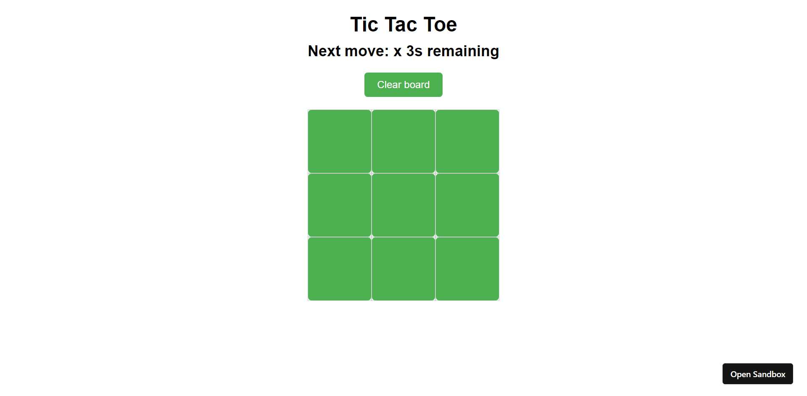
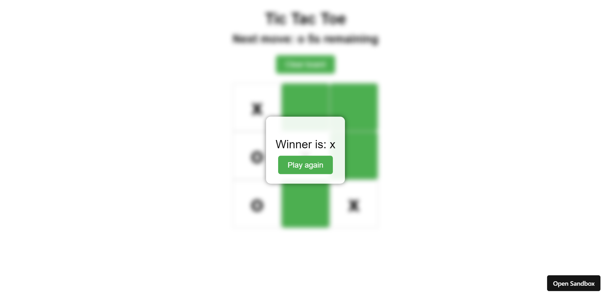

# TicTacToe

Simple Tic Tac Toe game created with React

## How to Run

You have 3 options to run this app:

### CodeSandbox

1. Open this link: https://codesandbox.io/p/sandbox/gui-tic-tac-toe-y868f4

### Docker

1. Clone this repository
2. run `docker compose up --build` in the root directory

### npm

1. Clone this repository
2. run `npm install` in the root directory
3. run `npm start` in the root directory
4. open `http://localhost:3000` in your browser
